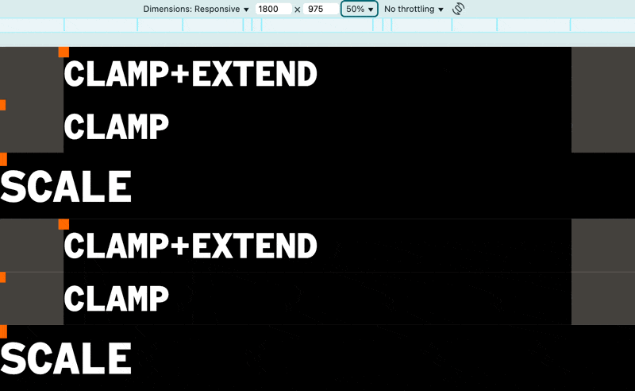
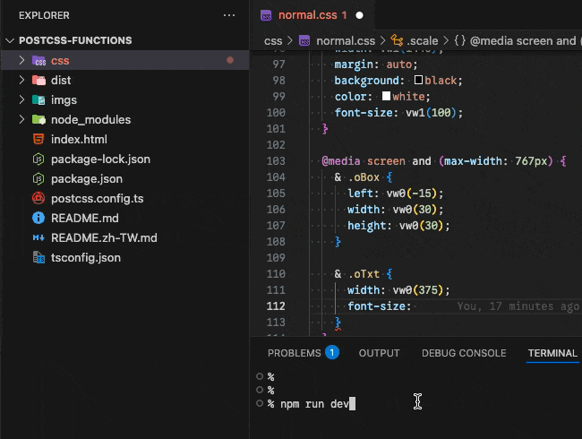

# css-gum

[](https://github.com/jzovvo/css-gum/actions/workflows/test.yml)
[](https://codecov.io/gh/jzovvo/css-gum)
[](https://www.npmjs.com/package/css-gum)

Make your responsive design stretch like gum—perfectly elastic adaptation across all screen sizes. This toolkit transforms complex viewport calculations into simple, intuitive functions and automatically generates VSCode snippets, letting you easily integrate into an efficient responsive development workflow.

[繁體中文](./README.zh-TW.md)

## Features

- 🖥️ **Viewport Units**: Convert pixels to responsive `vw`/`vh` units
- 🔒 **Constrained Units**: Use `vwc`/`vhc` to limit max/min values
- 📏 **Extended Scaling**: Adaptive scaling for screens larger than design drafts
- ⚡ **Batch Generation**: Batch generate functions for multiple design breakpoints
- 🎯 **Snippet**: Auto-generate code snippets to boost development efficiency

## Installation

```bash
npm install css-gum
```

## Quick Start

```typescript
import { Core } from "css-gum";

// Basic viewport units (default Tailwind compatible with trailing spaces)
Core.vw(20, 1440); // '1.39vw ' - 20px on 1440px design
Core.vh(30, 1080); // '2.78vh ' - 30px on 1080px design

// Control space parameter (for different use cases)
Core.vw(20, 1440, 1); // '1.39vw ' - explicitly with space
Core.vw(20, 1440, 0); // '1.39vw'  - explicitly without space

// Constrained units (prevent scaling beyond design size)
Core.vwc(20, 1440); // 'min(20px, 1.39vw)'
Core.vhc(30, 1080); // 'min(30px, 2.78vh)'

// Extended scaling (adapt to larger screens)
Core.vwe(20, 1440); // 'calc((100vw - 1440px) * 0.5 + 20px)'
Core.vhe(30, 1080); // 'calc((100vh - 1080px) * 0.5 + 30px)'

// Other utilities
Core.percent(10, 100); // '10%'
Core.percent(0, 100); // '0' (zero values return '0' instead of '0%')
Core.em(24, 16); // '1.5em'
Core.lh(24, 16); // '1.5'
```

## Usage Examples

### With [PostCSS Functions](https://www.npmjs.com/package/postcss-functions)



[View Complete Example →](./examples/postcss/postcss-functions/README.md)

## API

### Core Module

#### `vw(pixel, designDraft, space?)`

Convert pixels to viewport width units.

**Parameters**

- `pixel`
  - Pixel value to convert
- `designDraft`
  - Design draft width in pixels
- `space`
  - Whether to add trailing space for Tailwind multi-value syntax
  - `1` = with space, `0` = no space, default: `1`

```typescript
Core.vw(20, 1440); // '1.39vw ' (default with space, Tailwind compatible)
Core.vw(20, 1440, 1); // '1.39vw ' (explicitly with space)
Core.vw(20, 1440, 0); // '1.39vw'  (explicitly without space)
```

#### `vh(pixel, designDraft, space?)`

Convert pixels to viewport height units.

**Parameters**

- `pixel`
  - Pixel value to convert
- `designDraft`
  - Design draft height in pixels
- `space`
  - Whether to add trailing space for Tailwind multi-value syntax
  - `1` = with space, `0` = no space, default: `1`

```typescript
Core.vh(30, 1080); // '2.78vh ' (default with space, Tailwind compatible)
Core.vh(30, 1080, 1); // '2.78vh ' (explicitly with space)
Core.vh(30, 1080, 0); // '2.78vh'  (explicitly without space)
```

#### `vwc(pixel, designDraft)`

Constrained viewport width (prevents scaling beyond original size).

**Parameters**

- `pixel`
  - Pixel value to convert
- `designDraft`
  - Design draft width in pixels

```typescript
Core.vwc(20, 1440); // 'min(20px, 1.39vw)'
```

#### `vhc(pixel, designDraft)`

Constrained viewport height.

**Parameters**

- `pixel`
  - Pixel value to convert
- `designDraft`
  - Design draft height in pixels

```typescript
Core.vhc(30, 1080); // 'min(30px, 2.78vh)'
```

#### `vwe(pixel, designDraft, percent?)`

Extended viewport width, adapting to screens larger than design drafts.

**Parameters**

- `pixel`
  - Pixel value to convert
- `designDraft`
  - Design draft width in pixels
- `percent`
  - Scaling factor for screens larger than design draft
  - Default: 0.5

```typescript
Core.vwe(20, 1440, 0.5); // 'calc((100vw - 1440px) * 0.5 + 20px)'
Core.vwe(20, 1440); // Same as above, uses default value 0.5
```

#### `vhe(pixel, designDraft, percent?)`

Extended viewport height, adapting to screens larger than design drafts.

**Parameters**

- `pixel`
  - Pixel value to convert
- `designDraft`
  - Design draft height in pixels
- `percent`
  - Scaling factor for screens larger than design draft
  - Default: 0.5

```typescript
Core.vhe(30, 1080, 0.5); // 'calc((100vh - 1080px) * 0.5 + 30px)'
Core.vhe(30, 1080); // Same as above, uses default value 0.5
```

#### `percent(child, parent)`

Calculate percentage values.

**Parameters**

- `child`
  - Numerator
- `parent`
  - Denominator

```typescript
Core.percent(10, 100); // '10%'
Core.percent(0, 100); // '0' (zero values return '0')
```

#### `em(lineSize, fontSize)`

Convert to em units.

**Parameters**

- `lineSize`
  - Target size in pixels
- `fontSize`
  - Base font size in pixels

```typescript
Core.em(24, 16); // '1.5em'
```

#### `lh(lineHeight, fontSize)`

Convert to line height ratio.

**Parameters**

- `lineHeight`
  - Target line height in pixels
- `fontSize`
  - Base font size in pixels

```typescript
Core.lh(24, 16); // '1.5'
```

### Util Module

#### `cssPxToVw(designDraft)(pixel)`

Convert pixels to CSS vw string curried function.

**Parameters**

- `designDraft`
  - Design draft width in pixels
- `pixel`
  - Pixel value to convert

```typescript
import { Util } from "css-gum";

const toVw = Util.cssPxToVw(1440);
toVw(20); // '1.39vw'
toVw(0); // '0'
```

#### `cssPxToVh(designDraft)(pixel)`

Convert pixels to CSS vh string curried function.

**Parameters**

- `designDraft`
  - Design draft height in pixels
- `pixel`
  - Pixel value to convert

```typescript
const toVh = Util.cssPxToVh(1080);
toVh(30); // '2.78vh'
```

#### `cssPxToVwc(designDraft)(pixel)`

Convert pixels to constrained vw curried function.

**Parameters**

- `designDraft`
  - Design draft width in pixels
- `pixel`
  - Pixel value to convert

```typescript
const toVwc = Util.cssPxToVwc(1440);
toVwc(20); // 'min(20px, 1.39vw)'
toVwc(-20); // 'max(-20px, -1.39vw)'
```

#### `cssPxToVhc(designDraft)(pixel)`

Convert pixels to constrained vh curried function.

**Parameters**

- `designDraft`
  - Design draft height in pixels
- `pixel`
  - Pixel value to convert

```typescript
const toVhc = Util.cssPxToVhc(1080);
toVhc(30); // 'min(30px, 2.78vh)'
```

#### `cssPxToVwe(designDraft)(percent)(pixel)`

Convert pixels to extended vw curried function.

**Parameters**

- `designDraft`
  - Design draft width in pixels
- `percent`
  - Scaling factor for screens larger than design draft
- `pixel`
  - Pixel value to convert

```typescript
const toVwe = Util.cssPxToVwe(1440)(0.5);
toVwe(20); // 'calc((100vw - 1440px) * 0.5 + 20px)'
```

#### `cssPxToVhe(designDraft)(percent)(pixel)`

Convert pixels to extended vh curried function.

**Parameters**

- `designDraft`
  - Design draft height in pixels
- `percent`
  - Scaling factor for screens larger than design draft
- `pixel`
  - Pixel value to convert

```typescript
const toVhe = Util.cssPxToVhe(1080)(0.5);
toVhe(30); // 'calc((100vh - 1080px) * 0.5 + 30px)'
```

#### `percent(denominator)(numerator)`

Calculate percentage curried function.

**Parameters**

- `denominator` - Denominator value
- `numerator` - Numerator value

```typescript
const getPercent = Util.percent(100);
getPercent(25); // 25 (number)
```

#### `cssPercent(parent)(child)`

Calculate CSS percentage string curried function.

**Parameters**

- `parent`
  - Denominator
- `child`
  - Numerator

```typescript
const toCssPercent = Util.cssPercent(100);
toCssPercent(25); // '25%'
toCssPercent(0); // '0' (zero values return '0')
```

#### `cssEm(lineSize, fontSize)`

Calculate CSS em values.

**Parameters**

- `lineSize`
  - Target size in pixels
- `fontSize`
  - Base font size in pixels

```typescript
Util.cssEm(24, 16); // '1.5em'
```

#### `cssLh(lineHeight, fontSize)`

Calculate CSS line height ratio.

**Parameters**

- `lineHeight`
  - Target line height in pixels
- `fontSize`
  - Base font size in pixels

```typescript
Util.cssLh(24, 16); // '1.5'
```

### Gen Module

The generator module provides functionality for batch creating functions and VSCode snippets, allowing you to quickly generate corresponding functions for multiple design draft breakpoints.

#### `genFuncsDraftWidth(options)`

Generate width conversion functions for multiple design draft breakpoints.

**Parameters**

- `options`
  - `points`
    - Array of design draft widths in pixels
    - Invalid values (≤ 0) will be automatically filtered
  - `firstIndex`
    - Starting index number (default: 1)
  - `nameVw`, `nameVwc`, `nameVwe`
    - Custom function name prefixes
    - Use empty string `''` to skip generating that type

```typescript
import { Gen } from "css-gum";

const widthFuncs = Gen.genFuncsDraftWidth({
  points: [375, 768, 1440, 1920],
  firstIndex: 1,
});

widthFuncs.core.vw1(20); // '5.33vw ' - 20px on 375px design (default with space)
widthFuncs.core.vw1(20, 0); // '5.33vw'  - 20px on 375px design (without space)
widthFuncs.core.vwc2(20); // 'min(20px, 2.60vw)' - constrained 20px on 768px design
widthFuncs.core.vwe3(20); // extended function - extended 20px on 1440px design

// Invalid breakpoints will be automatically filtered
const filteredFuncs = Gen.genFuncsDraftWidth({
  points: [0, -100, 375, 768, -50], // Only 375 and 768 are valid
});
// Only generates: core.vw1, core.vw2, core.vwc1, core.vwc2, core.vwe1, core.vwe2

// Use empty strings to skip specific function types
const partialFuncs = Gen.genFuncsDraftWidth({
  points: [375, 768],
  nameVw: "vw", // Generate vw functions
  nameVwc: "", // Skip vwc functions
  nameVwe: "extend", // Generate extended functions
});

// Only generates: core.vw1, core.vw2, core.extend1, core.extend2
```

#### `genFuncsDraftHeight(options)`

Generate height conversion functions for multiple design draft breakpoints.

**Parameters**

- `options`
  - `points`
    - Array of design draft heights in pixels
    - Invalid values (≤ 0) will be automatically filtered
  - `firstIndex`
    - Starting index number (default: 1)
  - `nameVh`, `nameVhc`, `nameVhe`
    - Custom function name prefixes
    - Use empty string `''` to skip generating that type

```typescript
const heightFuncs = Gen.genFuncsDraftHeight({
  points: [667, 1080, 1440],
});

heightFuncs.core.vh1(30); // '4.50vh ' - 30px on 667px design (default with space)
heightFuncs.core.vh1(30, 0); // '4.50vh'  - 30px on 667px design (without space)
heightFuncs.core.vhc2(30); // 'min(30px, 2.78vh)' - constrained 30px on 1080px design

// Invalid breakpoints will be automatically filtered
const filteredHeightFuncs = Gen.genFuncsDraftHeight({
  points: [0, -200, 667, 1080, -100], // Only 667 and 1080 are valid
});
// Only generates: core.vh1, core.vh2, core.vhc1, core.vhc2, core.vhe1, core.vhe2

// Skip specific function types
const onlyVhFuncs = Gen.genFuncsDraftHeight({
  points: [667, 1080],
  nameVh: "vh",
  nameVhc: "", // Skip constrained functions
  nameVhe: "", // Skip extended functions
});

// Only generates: core.vh1, core.vh2
```

#### `genFuncsCore(options)`

Generate core function collection with custom names.

**Parameters**

- `options`
  - `nameVw`, `nameVh`, `nameVwc`, `nameVhc`, `nameVwe`, `nameVhe`, `nameEm`, `nameLh`, `namePercent`
    - Custom function name prefixes
    - Use empty string `''` to exclude

```typescript
const customCore = Gen.genFuncsCore({
  nameVw: "toVw",
  namePercent: "toPercent",
});

customCore.core.toVw(20, 1440); // Equivalent to Core.vw(20, 1440) - default with space
customCore.core.toVw(20, 1440, 0); // Equivalent to Core.vw(20, 1440, 0) - without space
customCore.core.toPercent(10, 100); // Equivalent to Core.percent(10, 100)

// Exclude specific functions
const minimalCore = Gen.genFuncsCore({
  nameVw: "vw",
  nameVh: "vh",
  nameVwc: "", // Exclude constrained width
  nameVhc: "", // Exclude constrained height
  nameVwe: "", // Exclude extended width
  nameVhe: "", // Exclude extended height
  nameEm: "", // Exclude em functions
  nameLh: "", // Exclude line height functions
  namePercent: "", // Exclude percentage functions
});

// Only generates: core.vw, core.vh functions
```

### Snippet Module



The Snippet module can automatically generate [VSCode Snippets](https://code.visualstudio.com/docs/editing/userdefinedsnippets) files, allowing you to quickly input css-gum functions in the editor.

- 🔄 **Auto Merge**: New snippets will merge with existing files, not overwriting other snippets
- 🛡️ **Safe Backup**: Automatically creates backup if existing file format is incorrect
- 📁 **Directory Creation**: Automatically creates output directory if it doesn't exist

**Usage Workflow**

The Snippet module usage is divided into two steps:

1. **Generate Snippets**: Get `SnippetConfig` objects through various generation functions
2. **Write to Files**: Use `writeSnippetsToFiles` to write snippets to VSCode files

#### `writeSnippetsToFiles(snippets, output)`

- Write snippets to VSCode snippets files.
- Not available in browser environment because browser environment doesn't have `fs` module

**Parameters**

- `snippets`
  - Snippet object (`SnippetConfig`)
- `output`
  - Array of output file paths

```typescript
import { Snippet } from "css-gum";

const snippets = {
  vw1: {
    prefix: "vw1",
    body: "vw1($1,$2)",
  },
  vwc1: {
    prefix: "vwc1",
    body: "vwc1($1,$2)",
  },
  percent: {
    prefix: "percent",
    body: "percent($1,$2)",
  },
};
const outputPaths = ["/path/to/.vscode/css.code-snippets"];

Snippet.writeSnippetsToFiles(snippets, outputPaths);
```

#### Generate SnippetConfig

There are two ways to generate snippet objects:

**Using Gen Module**

All generator functions include a `VSCodeSnippet` property to get the corresponding snippet object.

```typescript
import { Gen, Snippet } from "css-gum";

const VSCodeSnippetsPath = ["/path/to/.vscode/css.code-snippets"];

// Generate core function snippets
const coreGen = Gen.genFuncsCore();
const coreSnippets = coreGen.VSCodeSnippet;
Snippet.writeSnippetsToFiles(coreSnippets, VSCodeSnippetsPath);

// Generate width function snippets
const widthGen = Gen.genFuncsDraftWidth({
  points: [375, 768, 1440],
  firstIndex: 1,
});
const widthSnippets = widthGen.VSCodeSnippet;
Snippet.writeSnippetsToFiles(widthSnippets, VSCodeSnippetsPath);

// Generate height function snippets
const heightGen = Gen.genFuncsDraftHeight({
  points: [667, 1080, 1440],
});
const heightSnippets = heightGen.VSCodeSnippet;
Snippet.writeSnippetsToFiles(heightSnippets, VSCodeSnippetsPath);
```

**Using Snippet Module**

##### `genVSCodeSnippetCore(options)`

Generate core function snippets.

**Parameters**

- `options`
  - `nameVw`, `nameVh`, `nameVwc`, `nameVhc`, `nameVwe`, `nameVhe`, `nameEm`, `nameLh`, `namePercent`
    - Custom function name prefixes
    - Use empty string `''` to skip generating that type

##### `genVSCodeSnippetDraftWidth(options)`

Generate width function snippets.

**Parameters**

- `options`
  - `pointsSize`
    - Number of breakpoints to generate
  - `firstIndex`
    - Starting index number (default: 1)
  - `nameVw`, `nameVwc`, `nameVwe`
    - Custom function name prefixes
    - Use empty string `''` to skip generating that type

##### `genVSCodeSnippetDraftHeight(options)`

Generate height function snippets.

**Parameters**

- `options`
  - `pointsSize`
    - Number of breakpoints to generate
  - `firstIndex`
    - Starting index number (default: 1)
  - `nameVh`, `nameVhc`, `nameVhe`
    - Custom function name prefixes
    - Use empty string `''` to skip generating that type

```typescript
import { Snippet } from "css-gum";

const VSCodeSnippetsPath = ["/path/to/.vscode/css.code-snippets"];

// Generate core function snippets
const coreSnippets = Snippet.genVSCodeSnippetCore({
  nameVw: "vw",
  nameVh: "vh",
  namePercent: "percent",
});
Snippet.writeSnippetsToFiles(coreSnippets, VSCodeSnippetsPath);

// Generate width function snippets
const widthSnippets = Snippet.genVSCodeSnippetDraftWidth({
  pointsSize: 3,
  firstIndex: 1,
  nameVw: "vw",
  nameVwc: "vwc",
  nameVwe: "vwe",
});
Snippet.writeSnippetsToFiles(widthSnippets, VSCodeSnippetsPath);

// Generate height function snippets
const heightSnippets = Snippet.genVSCodeSnippetDraftHeight({
  pointsSize: 3,
  firstIndex: 1,
  nameVh: "vh",
  nameVhc: "vhc",
  nameVhe: "vhe",
});
Snippet.writeSnippetsToFiles(heightSnippets, VSCodeSnippetsPath);
```

##### Customize Snippet Names

You can use empty strings to skip unwanted snippet types.

```typescript
// Only generate vw-related snippets, skip vwc and vwe
const minimalSnippets = Snippet.genVSCodeSnippetDraftWidth({
  pointsSize: 2,
  nameVw: "vw",
  nameVwc: "", // Skip vwc snippets
  nameVwe: "", // Skip vwe snippets
});
Snippet.writeSnippetsToFiles(minimalSnippets, ["/path/to/.vscode/minimal.code-snippets"]);
```

## Error Handling

All functions include built-in validation and colored error messages, returning empty strings for invalid inputs.

```typescript
Core.vw("invalid", 1440); // Returns '', logs red error message
Core.vw(20, "invalid"); // Returns '', logs red error message
Core.vw(20, 0); // Returns '' (zero/negative design draft rejected)
Core.vw(20, -100); // Returns '' (zero/negative design draft rejected)
Core.vw(20, 1440); // Returns '1.39vw ' (default with space)

// Error messages include stack trace for debug
Core.vw("invalid", 1920);
// Output: [error] pixel expected number, received invalid
//      designDraft expected number, received 1920
//      Error: <stack trace>
```

## Browser Support

Supports all modern browsers that support the following features.

- Viewport units (`vw`, `vh`)
- CSS `calc()` function
- CSS `min()`/`max()` functions

## Support

If `css-gum` makes your design stretch like gum with perfect elasticity, consider buying me a coffee☕
Your support keeps this project sticky and helps it become even more flexible🍬

[](https://ko-fi.com/jzovvo)

## Not Stretching Right?

Is `css-gum` not stretching smoothly in your hands? Something feels a bit sticky? Don't worry, let's work together to make it more elastic 🍬

- 🐛 [Issues](https://github.com/jzovvo/css-gum/issues)
- 💭 [Discussions](https://github.com/jzovvo/css-gum/discussions)
- 📮 [Mail](mailto:jzovvo@gmail.com)
- 💻 [Site](https://jzovvo.dev)

## License

MIT © [jzovvo](https://github.com/jzovvo)

## Q&A

### Why do we need the space parameter?

When using `Tailwind CSS` multi-value syntax, if CSS function return values don't have trailing spaces, the compiled values sometimes concatenate together after build, for unknown reasons.

```html
<!-- ❌ Compilation result may be: padding: 1.39vw2.08vw; -->
<div class="p-[vw(20,1440)_vw(30,1440)]"></div>
```

So adding a space in the output directly solves this problem `padding: 1.39vw 2.08vw ;`
If you're a bit of a formatting perfectionist, you can add a `0` parameter to the last function to avoid trailing spaces.

```html
<!-- ✅ Compilation result: padding: 1.39vw 2.08vw; -->
<div class="p-[vw(20,1440)_vw(30,1440,0)]"></div>
```
