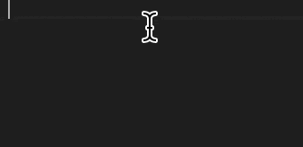

# css-gum

[](https://github.com/jzovvo/css-gum/actions/workflows/test.yml)
[](https://codecov.io/gh/jzovvo/css-gum)
[](https://www.npmjs.com/package/css-gum)

讓你的響應式設計像口香糖一樣伸縮自如 — 在各種螢幕尺寸間完美彈性適應。這個工具包將複雜的視窗計算轉化為簡單直觀的函數，並自動生成 VS Code 代碼片段，讓你輕鬆黏合到高效的響應式開發工作流中。

[English](./README.md)

## 功能特色

- 🖥️ **視窗單位**：將像素轉換為響應式 `vw`/`vh` 單位
- 🔒 **限制單位**：使用 `vwc`/`vhc` 限制最大/最小值
- 📏 **延伸縮放**：適應比設計稿更大螢幕的自適應縮放
- ⚡ **批量生成**：為多個設計稿斷點批量生成函數
- 🎯 **Snippet**：自動生成代碼片段，提升開發效率

## 安裝

```bash
npm install css-gum
```

## 快速開始

```typescript
import { Core } from "css-gum";

// 基本視窗單位
Core.vw(20, 1440); // '1.39vw' - 1440px 設計稿上的 20px
Core.vh(30, 1080); // '2.78vh' - 1080px 設計稿上的 30px

// 限制單位（防止縮放超過設計尺寸）
Core.vwc(20, 1440); // 'min(20px, 1.39vw)'
Core.vhc(30, 1080); // 'min(30px, 2.78vh)'

// 延伸縮放（適應更大螢幕）
Core.vwe(20, 1440); // 'calc((100vw - 1440px) * 0.5 + 20px)'
Core.vhe(30, 1080); // 'calc((100vh - 1080px) * 0.5 + 30px)'

// 其他工具
Core.percent(10, 100); // '10%'
Core.percent(0, 100); // '0'（零值返回 '0' 而非 '0%'）
Core.em(24, 16); // '1.5em'
Core.lh(24, 16); // '1.5'
```

## 使用場景範例

### 搭配 [PostCSS Functions](https://www.npmjs.com/package/postcss-functions)


[查看完整範例 →](./examples/vite/README.zh-TW.md)

## API

### Core Module

#### `vw(pixel, designDraft)`

將像素轉換為視窗寬度單位。

```typescript
Core.vw(20, 1440); // '1.39vw'
```

#### `vh(pixel, designDraft)`

將像素轉換為視窗高度單位。

```typescript
Core.vh(30, 1080); // '2.78vh'
```

#### `vwc(pixel, designDraft)`

有限制的視窗寬度（防止縮放超過原始尺寸）。

```typescript
Core.vwc(20, 1440); // 'min(20px, 1.39vw)'
```

#### `vhc(pixel, designDraft)`

有限制的視窗高度。

```typescript
Core.vhc(30, 1080); // 'min(30px, 2.78vh)'
```

#### `vwe(pixel, designDraft, percent?)`

延伸視窗寬度，適應比設計稿更大的螢幕。

```typescript
Core.vwe(20, 1440, 0.5); // 'calc((100vw - 1440px) * 0.5 + 20px)'
```

#### `vhe(pixel, designDraft, percent?)`

延伸視窗高度，適應比設計稿更大的螢幕。

```typescript
Core.vhe(30, 1080, 0.5); // 'calc((100vh - 1080px) * 0.5 + 30px)'
```

#### `percent(child, parent)`

計算百分比值。

```typescript
Core.percent(10, 100); // '10%'
Core.percent(0, 100); // '0'（零值返回 '0'）
```

#### `em(lineSize, fontSize)`

轉換為 em 單位。

```typescript
Core.em(24, 16); // '1.5em'
```

#### `lh(lineHeight, fontSize)`

轉換為行高比例。

```typescript
Core.lh(24, 16); // '1.5'
```

### Utils Module

#### `cssPxToVw(designDraft)(pixel)`

將像素轉換為 CSS vw 字串的 curried 函數。

```typescript
import { Utils } from "css-gum";

const toVw = Utils.cssPxToVw(1440);
toVw(20); // '1.39vw'
toVw(0); // '0'
```

#### `cssPxToVh(designDraft)(pixel)`

將像素轉換為 CSS vh 字串的 curried 函數。

```typescript
const toVh = Utils.cssPxToVh(1080);
toVh(30); // '2.78vh'
```

#### `cssPxToVwc(designDraft)(pixel)`

將像素轉換為限制型 vw 的 curried 函數。

```typescript
const toVwc = Utils.cssPxToVwc(1440);
toVwc(20); // 'min(20px, 1.39vw)'
toVwc(-20); // 'max(-20px, -1.39vw)'
```

#### `cssPxToVhc(designDraft)(pixel)`

將像素轉換為限制型 vh 的 curried 函數。

```typescript
const toVhc = Utils.cssPxToVhc(1080);
toVhc(30); // 'min(30px, 2.78vh)'
```

#### `cssPxToVwe(designDraft)(percent)(pixel)`

將像素轉換為延伸型 vw 的 curried 函數。

```typescript
const toVwe = Utils.cssPxToVwe(1440)(0.5);
toVwe(20); // 'calc((100vw - 1440px) * 0.5 + 20px)'
```

#### `cssPxToVhe(designDraft)(percent)(pixel)`

將像素轉換為延伸型 vh 的 curried 函數。

```typescript
const toVhe = Utils.cssPxToVhe(1080)(0.5);
toVhe(30); // 'calc((100vh - 1080px) * 0.5 + 30px)'
```

#### `percent(denominator)(numerator)`

計算百分比的 curried 函數。

```typescript
const getPercent = Utils.percent(100);
getPercent(25); // 25 (數值)
```

#### `cssPercent(parent)(child)`

計算 CSS 百分比字串的 curried 函數。

```typescript
const toCssPercent = Utils.cssPercent(100);
toCssPercent(25); // '25%'
toCssPercent(0); // '0'（零值返回 '0'）
```

#### `cssEm(lineSize, fontSize)`

計算 CSS em 值。

```typescript
Utils.cssEm(24, 16); // '1.5em'
```

#### `cssLh(lineHeight, fontSize)`

計算 CSS 行高比例。

```typescript
Utils.cssLh(24, 16); // '1.5'
```

### Gen Module

生成器模組提供了批量創建函數和 VS Code 程式碼片段的功能，讓你可以為多個設計稿斷點快速生成對應的函數。

#### `genFuncsDraftWidth(options)`

為多個設計稿斷點生成寬度轉換函數。

**options**

- `points` - 設計稿寬度陣列（像素）- 無效值（≤ 0）會自動被過濾
- `firstIndex` - 起始索引號（預設：1）
- `nameVw`, `nameVwc`, `nameVwe` - 自訂函數名稱前綴（使用空字串 `''` 可跳過生成該類型）

```typescript
import { Gen } from "css-gum";

const widthFuncs = Gen.genFuncsDraftWidth({
  points: [375, 768, 1440, 1920],
  firstIndex: 1,
});

widthFuncs.core.vw1(20); // 375px 設計稿上的 20px
widthFuncs.core.vwc2(20); // 768px 設計稿上的限制 20px
widthFuncs.core.vwe3(20); // 1440px 設計稿上的延伸 20px

// 無效的斷點會自動被過濾
const filteredFuncs = Gen.genFuncsDraftWidth({
  points: [0, -100, 375, 768, -50], // 只有 375 和 768 是有效的
});
// 只生成：core.vw1, core.vw2, core.vwc1, core.vwc2, core.vwe1, core.vwe2

// 使用空字串跳過特定函數類型
const partialFuncs = Gen.genFuncsDraftWidth({
  points: [375, 768],
  nameVw: "vw", // 生成 vw 函數
  nameVwc: "", // 跳過 vwc 函數
  nameVwe: "extend", // 生成延伸函數
});

// 只生成：core.vw1, core.vw2, core.extend1, core.extend2
```

#### `genFuncsDraftHeight(options)`

為多個設計稿斷點生成高度轉換函數。

**options**

- `points` - 設計稿高度陣列（像素）- 無效值（≤ 0）會自動被過濾
- `firstIndex` - 起始索引號（預設：1）
- `nameVh`, `nameVhc`, `nameVhe` - 自訂函數名稱前綴（使用空字串 `''` 可跳過生成該類型）

```typescript
const heightFuncs = Gen.genFuncsDraftHeight({
  points: [667, 1080, 1440],
});

heightFuncs.core.vh1(30); // 667px 設計稿上的 30px
heightFuncs.core.vhc2(30); // 1080px 設計稿上的限制 30px

// 無效的斷點會自動被過濾
const filteredHeightFuncs = Gen.genFuncsDraftHeight({
  points: [0, -200, 667, 1080, -100], // 只有 667 和 1080 是有效的
});
// 只生成：core.vh1, core.vh2, core.vhc1, core.vhc2, core.vhe1, core.vhe2

// 跳過特定函數類型
const onlyVhFuncs = Gen.genFuncsDraftHeight({
  points: [667, 1080],
  nameVh: "vh",
  nameVhc: "", // 跳過限制函數
  nameVhe: "", // 跳過延伸函數
});

// 只生成：core.vh1, core.vh2
```

#### `genFuncsCore(options)`

生成具有自訂名稱的核心函數集合。

**options**

- `nameVw`, `nameVh`, `nameVwc`, `nameVhc`, `nameVwe`, `nameVhe`, `nameEm`, `nameLh`, `namePercent` - 自訂函數名稱前綴（使用空字串 `''` 可排除）

```typescript
const customCore = Gen.genFuncsCore({
  nameVw: "toVw",
  namePercent: "toPercent",
});

customCore.core.toVw(20, 1440); // 等同於 Core.vw(20, 1440)
customCore.core.toPercent(10, 100); // 等同於 Core.percent(10, 100)

// 排除特定函數
const minimalCore = Gen.genFuncsCore({
  nameVw: "vw",
  nameVh: "vh",
  nameVwc: "", // 排除限制寬度
  nameVhc: "", // 排除限制高度
  nameVwe: "", // 排除延伸寬度
  nameVhe: "", // 排除延伸高度
  nameEm: "", // 排除 em 函數
  nameLh: "", // 排除行高函數
  namePercent: "", // 排除百分比函數
});

// 只生成：core.vw, core.vh 函數
```

### Snippet Module



Snippet 模組可以自動生成 [VSCode Snippet](https://code.visualstudio.com/docs/editing/userdefinedsnippets) 文件，讓你在編輯器中快速輸入 css-gum 函數。

- 🔄 **自動合併**：新代碼片段會與現有文件合併，不會覆蓋其他片段
- 🛡️ **安全備份**：如果現有文件格式錯誤，會自動創建備份
- 📁 **創建目錄**：如果輸出目錄不存在，會自動創建

#### Gen

所有生成器函數都包含 `genVscodeSnippet()` 方法，可以生成對應的 VS Code 代碼片段：

```typescript
import { Gen } from "css-gum";

const VscodeSnippetsPath = ["/path/to/.vscode/css.code-snippets"];

// 生成基礎核心函數的代碼片段
const coreGen = Gen.genFuncsCore();
coreGen.genVscodeSnippet(VscodeSnippetsPath);

// 生成寬度函數的代碼片段
const widthGen = Gen.genFuncsDraftWidth({
  points: [375, 768, 1440],
  firstIndex: 1,
});
widthGen.genVscodeSnippet(VscodeSnippetsPath);

// 生成高度函數的代碼片段
const heightGen = Gen.genFuncsDraftHeight({
  points: [667, 1080, 1440],
});
heightGen.genVscodeSnippet(VscodeSnippetsPath);
```

#### Snippet

你也可以直接使用 Snippet 模組的函數來生成代碼片段：

```typescript
import { Snippet } from "css-gum";

const VscodeSnippetsPath = ["/path/to/.vscode/css.code-snippets"];

// 生成核心函數代碼片段
Snippet.genVscodeSnippetCore({
  nameVw: "vw",
  nameVh: "vh",
  namePercent: "percent",
  output: VscodeSnippetsPath,
});

// 生成寬度函數代碼片段
Snippet.genVscodeSnippetDraftWidth({
  pointsSize: 3,
  firstIndex: 1,
  nameVw: "vw",
  nameVwc: "vwc",
  nameVwe: "vwe",
  output: VscodeSnippetsPath,
});

// 生成高度函數代碼片段
Snippet.genVscodeSnippetDraftHeight({
  pointsSize: 3,
  firstIndex: 1,
  nameVh: "vh",
  nameVhc: "vhc",
  nameVhe: "vhe",
  output: VscodeSnippetsPath,
});
```

#### 生成的代碼片段範例

```json
{
  "vw1": {
    "prefix": "vw1",
    "body": "vw1($1,$2)"
  },
  "vwc1": {
    "prefix": "vwc1",
    "body": "vwc1($1,$2)"
  },
  "percent": {
    "prefix": "percent",
    "body": "percent($1,$2)"
  }
}
```

#### 自定義代碼片段名稱

你可以通過空字串來跳過不需要的代碼片段類型

```typescript
// 只生成 vw 相關的代碼片段，跳過 vwc 和 vwe
Snippet.genVscodeSnippetDraftWidth({
  pointsSize: 2,
  nameVw: "vw",
  nameVwc: "", // 跳過 vwc 代碼片段
  nameVwe: "", // 跳過 vwe 代碼片段
  output: ["/path/to/.vscode/minimal.code-snippets"],
});
```

## 錯誤處理

所有函數都包含內建驗證和彩色錯誤訊息，對於無效輸入會返回空字串：

```typescript
Core.vw("invalid", 1440); // 返回 ''，記錄紅色錯誤訊息
Core.vw(20, "invalid"); // 返回 ''，記錄紅色錯誤訊息
Core.vw(20, 0); // 返回 ''（零/負數設計稿被拒絕）
Core.vw(20, -100); // 返回 ''（零/負數設計稿被拒絕）
Core.vw(20, 1440); // 返回 '1.39vw'

// 錯誤訊息包含堆疊追踪以便除錯
Core.vw("invalid", 1920);
// 輸出：[error] pixel expected number, received invalid
//      designDraft expected number, received 1920
//      Error: <堆疊追踪>
```

## 瀏覽器支援

支援所有支援以下功能的現代瀏覽器：

- 視窗單位（`vw`、`vh`）
- CSS `calc()` 函數
- CSS `min()`/`max()` 函數

## 授權

MIT © [jzovvo](https://github.com/jzovvo)
