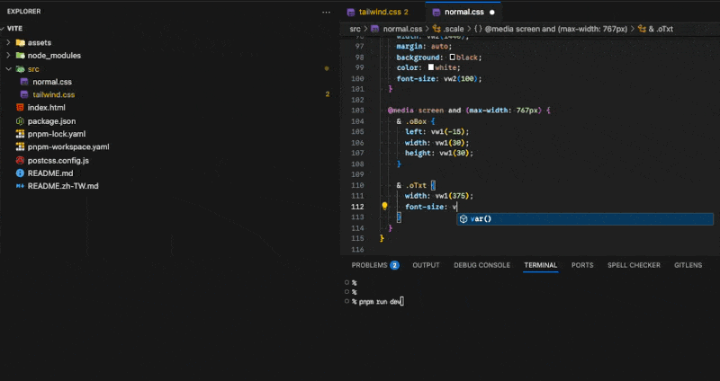

# CSS Gum + Vite 範例

這個範例展示如何在 Vite 專案中使用 css-gum 搭配 [PostCSS Functions](https://www.npmjs.com/package/postcss-functions) 外掛，實作響應式設計的數值計算。

## 執行範例

```bash
pnpm install
pnpm dev
```

## 範例說明


- 本範例包含三種縮放模式的對比：
  1. **SCALE** - 純縮放，元素會無限制地根據視窗大小變化
  2. **CLAMP** - 限制縮放，在中斷點範圍內才會縮放
  3. **CLAMP+EXTEND** - 結合 clamp 和 extend，提供更精細的控制

- 每個範例都同時展示了 Tailwind CSS 和 CSS 的寫法。

## Core

- 藉由 `postcss-functions` 可以執行函式並將返回值替換的特性，將需要使用的函式都寫入 `postcss-functions` 配置中來攔截，以達成攔截函式並替換成 CSS 值
- 在 `postcss.config.js` 中設定 css-gum 函數：

```js
import { Gen } from "css-gum";

export default {
  plugins: {
    "@tailwindcss/postcss": {},
    "postcss-functions": {
      functions: {
        // 將會使用到的函式都加入，讓 postcss-functions 攔截來執行並替換
        // 假設有兩張設計稿，分別是 375px 與 1440px 的大小
        ...Gen.genFuncsDraftWidth({ points: [375, 1440] }).core,
      },
    },
  },
};
```

這個配置會產生以下函式：

- 🖥️ **Scale 純縮放**: `vw1()`, `vw2()`
  - 元素會根據視窗寬度等比例縮放，沒有上下限制。

- 🔒 **Clamp 限制縮放**: `vwc1()`, `vwc2()`
  - 元素會根據視窗寬度縮放，但有最大值／最小值限制。

- 📏 **Extend 延伸縮放**: `vwe1()`, `vwe2()`
  - 當視窗寬度超出中斷點範圍時，元素會保持固定的計算值
  - 適合處理負邊界等需要精確控制的情境

數字後綴對應設計稿大小：

- `1` = 375px 設計稿
- `2` = 1440px 設計稿

### 使用方式

#### 在 Tailwind CSS 中使用

```html
<div class="text-[length:vw2(100)] max-[768px]:text-[length:vw1(100)]">TEXT</div>
```

#### 在 CSS 中使用

```html
<div class="text">TEXT</div>
```

```css
.text {
  font-size: vw2(100);
  @media screen and (max-width: 767px) {
    font-size: vw1(100);
  }
}
```

## Snippet

- `genVSCodeSnippet` 自動產生 VSCode 程式碼片段，讓你可以在編輯器中快速輸入 css-gum 函式。

```js
import { Gen } from "css-gum";
import { join } from "path";

const points = [375, 1440];
const snippetUrl = [
  join(import.meta.dirname, ".vscode/css.code-snippets"), // 目標 output
];
const { genVSCodeSnippet } = Gen.genFuncsDraftWidth({ points: points });

genVSCodeSnippet(snippetUrl);
```

### 使用說明

- 根據你指定的 snippet 檔案類型不同，生效的檔案範圍也會不同，詳情請看 [VSCode Snippet 文件](https://code.visualstudio.com/docs/editing/userdefinedsnippets)
- 這裡以 `css.code-snippets` 為例，產生後在 CSS 檔案中就會有提示，按下 Tab 鍵即可自動補全函式呼叫，游標會自動定位到參數位置。



- 執行 `pnpm dev` 後，會在 `.vscode/css.code-snippets` 自動產生以下片段：

```json
{
  "vw1": {
    "prefix": "vw1",
    "body": "vw1($1)"
  },
  "vwc1": {
    "prefix": "vwc1",
    "body": "vwc1($1)"
  },
  "vwe1": {
    "prefix": "vwe1",
    "body": "vwe1($1)"
  },
  "vw2": {
    "prefix": "vw2",
    "body": "vw2($1)"
  },
  "vwc2": {
    "prefix": "vwc2",
    "body": "vwc2($1)"
  },
  "vwe2": {
    "prefix": "vwe2",
    "body": "vwe2($1)"
  }
}
```
